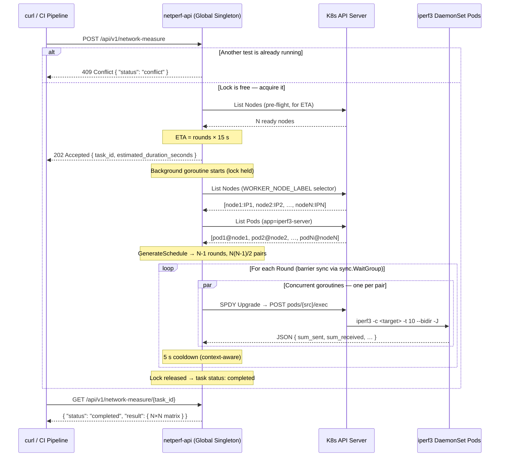

# netperf-api

A lightweight, **API-driven executor** for measuring full N×N network bandwidth between every node pair in a Kubernetes cluster using `iperf3`.

Instead of spawning ephemeral Jobs, it uses the **Exec pattern** — running `iperf3 -c <target> --bidir -J` directly inside a pre-deployed DaemonSet via `client-go` SPDY remotecommand (the same mechanism as `kubectl exec`). A **Global Lock** ensures only one measurement can run at a time, preventing port conflicts and skewed results.

---

## Architecture



### Design decisions

| Decision | Rationale |
|---|---|
| **Exec pattern** (no Jobs/Pods) | Eliminates pod-startup latency; reuses the always-running DaemonSet containers |
| **Global Singleton Lock** | A `sync.Mutex` in the handler ensures only one test runs at a time — prevents port 5201 conflicts and result cross-contamination |
| **`hostNetwork: true`** | iperf3 server binds to the node's real `InternalIP`; the executor discovers it via the Node object |
| **SPDY remotecommand** | Same multiplexed framing used by `kubectl exec`; carries stdout/stderr over a single TCP connection |
| **Circle-method scheduling** | Each node appears in at most one active pair per round — maximises parallelism without creating bandwidth bottlenecks |
| **Exec probes (not TCP socket probes)** | TCP socket probes half-open to port 5201 and immediately close, causing iperf3 `Bad file descriptor` errors in server logs |
| **`emptyDir` on `/tmp`** | iperf3 `--bidir` creates temporary stream state files under `/tmp`. A read-only root filesystem requires an explicit writable volume mount there |

---

## Prerequisites

| Tool | Minimum version |
|---|---|
| Go | 1.22 |
| Docker | any recent version |
| `kubectl` | matching cluster version |
| Kubernetes | 1.24+ |

---

## Quick Start

### 1 — Build

```bash
git clone https://github.com/netperf/netperf-api.git
cd netperf-api

make build          # produces bin/netperf-api
make docker-build   # builds docker.io/loihoangthanh1411/netperf-api:latest
make docker-push    # push to registry  (edit IMAGE / TAG in Makefile first)
```

### 2 — Deploy to Kubernetes

```bash
make deploy

kubectl -n netperf-api get pods
# NAME                           READY   STATUS    RESTARTS   AGE
# iperf3-server-<hash>  (×N)     1/1     Running   0          30s
# netperf-api-<hash>             1/1     Running   0          30s
```

> **Worker node label** — by default the executor targets nodes labelled
> `node-role.kubernetes.io/worker=true`. Override via `WORKER_NODE_LABEL` in
> [`deploy/deployment.yaml`](deploy/deployment.yaml) (see [Configuration](#configuration)).

### 3 — Run a measurement

```bash
# Forward the service to your workstation
make port-forward &

# Trigger a test
curl -s -X POST http://localhost:8080/api/v1/network-measure | jq

# Poll until complete
curl -s http://localhost:8080/api/v1/network-measure/<task_id> | jq
```

---

## Scheduling — Round-Robin (Circle Method)

The scheduler uses the **circle-method (round-robin tournament)** algorithm to build a conflict-free, fully-parallel test plan:

- If `N` is even: `N − 1` rounds are required.
- If `N` is odd: a synthetic `DUMMY` node is appended to make `N` even, giving `N` rounds (the real node paired with `DUMMY` idles that round).
- Within each round, all pairs execute **concurrently** via `sync.WaitGroup` — no node appears in more than one pair simultaneously.
- A **5-second cooldown** separates rounds to let TCP connections drain before the next burst.

Total unique pairs measured: `N × (N − 1) / 2`.

---

## Smart ETA

When you `POST` to start a measurement, the API performs a lightweight pre-flight node count and returns `estimated_duration_seconds` in the `202` response:

```
rounds = N − 1  (N even)   or   N  (N odd)
estimated_duration_seconds = rounds × 15
```

The 15-second-per-round constant is: **10 s** (`iperf3 -t 10`) + **5 s** (inter-round cooldown).

---

## Configuration

Set via the Deployment's `env` block in [`deploy/deployment.yaml`](deploy/deployment.yaml):

```yaml
env:
  - name: WORKER_NODE_LABEL
    value: "node-role.kubernetes.io/worker=true"   # default
```

| Distribution | Recommended label |
|---|---|
| kubeadm | `node-role.kubernetes.io/worker=true` |
| GKE | `cloud.google.com/gke-nodepool=<pool-name>` |
| EKS | `eks.amazonaws.com/nodegroup=<group-name>` |
| All nodes (incl. control-plane) | `kubernetes.io/os=linux` |

---

## API Reference

### `POST /api/v1/network-measure`

Starts a new measurement. Returns immediately — the test runs in a background goroutine.

```bash
curl -s -X POST http://localhost:8080/api/v1/network-measure | jq
```

**`202 Accepted` — measurement started:**

```json
{
  "task_id":                    "3f2a1b4c-8e9d-4f2a-b1c3-7e8f9d2a1b4c",
  "status":                     "accepted",
  "estimated_duration_seconds": 45,
  "message":                    "Measurement started. Please poll the GET endpoint."
}
```

**`409 Conflict` — another test is already running:**

```json
{
  "error":  "A network measurement is already in progress. Please try again later.",
  "status": "conflict"
}
```

---

### `GET /api/v1/network-measure/{task_id}`

Polls the status and, when complete, returns the full result matrix.

```bash
curl -s http://localhost:8080/api/v1/network-measure/3f2a1b4c-… | jq
```

**`200 OK` — while running:**

```json
{
  "task_id":    "3f2a1b4c-…",
  "status":     "running",
  "created_at": "2026-04-25T10:00:00Z"
}
```

**`200 OK` — completed (N = 3 nodes example):**

```json
{
  "task_id":    "3f2a1b4c-…",
  "status":     "completed",
  "created_at": "2026-04-25T10:00:00Z",
  "duration":   "40.28s",
  "result": {
    "nodes": [
      "192.168.40.209",
      "192.168.40.247",
      "192.168.40.246"
    ],
    "matrix": {
      "192.168.40.209": {
        "192.168.40.247": { "mbps_egress": 932.6, "mbps_ingress": 929.6 },
        "192.168.40.246": { "mbps_egress": 918.5, "mbps_ingress": 915.5 }
      },
      "192.168.40.247": {
        "192.168.40.209": { "mbps_egress": 924.4, "mbps_ingress": 921.5 },
        "192.168.40.246": { "mbps_egress": 874.5, "mbps_ingress": 872.0 }
      },
      "192.168.40.246": {
        "192.168.40.209": { "mbps_egress": 925.3, "mbps_ingress": 922.6 },
        "192.168.40.247": { "mbps_egress": 928.2, "mbps_ingress": 925.6 }
      }
    }
  }
}
```

**Matrix schema:**

| Field | Meaning |
|---|---|
| `matrix[src][tgt].mbps_egress` | Bandwidth *sent* by `src` toward `tgt` (Mbit/s) |
| `matrix[src][tgt].mbps_ingress` | Bandwidth *received* by `src` from `tgt` (Mbit/s) |
| `matrix[src][tgt].error` | Non-empty string when this specific pair failed; all other fields are absent |

Every pair is populated from a single `--bidir` exec, so `matrix[A][B]` and `matrix[B][A]` are both written from one measurement round.

**`200 OK` — failed:**

```json
{
  "task_id": "3f2a1b4c-…",
  "status":  "failed",
  "error":   "need at least 2 ready nodes, found 1"
}
```

---

### `DELETE /api/v1/network-measure/{task_id}`

Cancels a running test. Propagates `context.Canceled` into every in-flight SPDY exec stream; the background goroutine drains and the task transitions to `status: canceled`.

```bash
curl -s -X DELETE http://localhost:8080/api/v1/network-measure/3f2a1b4c-… | jq
```

**`202 Accepted` — signal sent:**

```json
{
  "task_id": "3f2a1b4c-…",
  "message": "cancellation signal sent; poll GET to confirm status=canceled"
}
```

**`409 Conflict` — task already in a terminal state:**

```json
{
  "error":  "task is not running",
  "status": "completed"
}
```

---

### `GET /healthz`

```bash
curl -s http://localhost:8080/healthz
# { "status": "ok" }
```

---

## Development

```bash
make test-unit   # scheduler algorithm + iperf3 parser  (no cluster required)
make test-e2e    # full live-cluster integration tests   (requires kubectl + 2+ nodes)
make logs        # tail API server logs
make clean       # remove bin/
```

**Running a single integration test:**

```bash
KUBECONFIG=~/.kube/config \
go test -v -tags integration -timeout 15m \
    -run TestE2E_FullMeasurementCycle \
    ./test/integration/
```

The integration tests create a temporary namespace (`iperf-test-<random>`), deploy an isolated DaemonSet, run measurements, assert the full matrix, then delete the namespace — even on failure.

---

## Project Structure

```
netperf-api/
├── cmd/main.go                          # Entry point
├── internal/
│   ├── api/handlers.go                  # POST / GET / DELETE / healthz + global lock
│   ├── executor/executor.go             # Round-robin orchestrator + SPDY exec
│   ├── k8sclient/client.go              # client-go bootstrap (in-cluster / kubeconfig)
│   ├── scheduler/scheduler.go           # Circle-method algorithm
│   ├── scheduler/scheduler_test.go      # Table-driven unit tests (N = 2 … 8)
│   └── store/store.go                   # sync.Map task + cancel-func store
├── pkg/iperf3/
│   ├── parser.go                        # iperf3 JSON → Go structs (warning-tolerant)
│   └── parser_test.go                   # Unit tests incl. mixed-type field fixtures
├── test/integration/integration_test.go # Live-cluster E2E tests
├── deploy/
│   ├── rbac.yaml                        # Namespace, SA, ClusterRole, CRB
│   ├── daemonset.yaml                   # iperf3 -s DaemonSet (hostNetwork + emptyDir /tmp)
│   └── deployment.yaml                  # netperf-api Deployment + Service
├── Dockerfile                           # Two-stage Alpine build
└── Makefile
```

---

## RBAC Requirements

The `netperf-api-sa` ServiceAccount (created by `deploy/rbac.yaml`) requires:

```
nodes       : get, list, watch
pods        : get, list, watch
pods/exec   : create   ← required for the SPDY exec subresource
```

The integration tests run under the kubeconfig user's credentials and require the same permissions cluster-wide. A `cluster-admin` ClusterRoleBinding satisfies all requirements.
