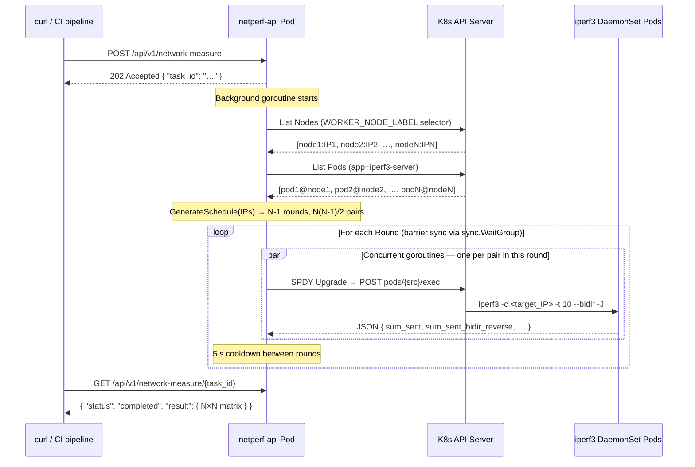

# netperf-api

A custom, lightweight **API-driven executor** for measuring N×N network bandwidth between every node pair in a Kubernetes cluster using `iperf3`.

Instead of spawning ephemeral Jobs, it uses the `kubectl exec` / SPDY-remotecommand pattern to run `iperf3 -c <target> --bidir -J` directly inside a pre-deployed DaemonSet of `iperf3 -s` servers. Tests are scheduled using the **circle-method (round-robin tournament)** algorithm so every node pair is covered exactly once, with maximum parallelism and no bandwidth bottlenecks.

---

## Architecture



### Key design decisions

| Decision | Rationale |
|---|---|
| **Exec pattern** (no Jobs) | Eliminates pod-startup latency (~seconds); reuses already-running DaemonSet containers |
| **`hostNetwork: true`** | iperf3 server binds to the node's real `InternalIP`; the executor discovers this IP via the Node object |
| **SPDY remotecommand** | Same multiplexed framing used by `kubectl exec`; carries stdin/stdout/stderr over a single TCP connection |
| **Circle-method scheduling** | Guarantees each node is in at most one active pair per round; prevents bandwidth saturation |
| **Exec probes (not TCP socket probes)** | TCP socket probes connect to port 5201 and immediately close, causing iperf3 `Bad file descriptor` errors |

---

## Prerequisites

| Tool | Minimum version |
|---|---|
| Go | 1.22 |
| Docker | any recent version |
| `kubectl` | matching the cluster version |
| Kubernetes cluster | 1.24+ |

---

## Quick Start

### 1 — Clone and build

```bash
git clone https://github.com/netperf/netperf-api.git
cd netperf-api

make build          # produces bin/netperf-api
make docker-build   # builds docker.io/loihoangthanh1411/netperf-api:latest
make docker-push    # push to registry (edit IMAGE/TAG in Makefile first)
```

### 2 — Deploy to Kubernetes

```bash
# Apply RBAC, DaemonSet, and API Deployment in one shot
make deploy

# Verify
kubectl -n netperf-api get pods
# NAME                           READY   STATUS    RESTARTS   AGE
# iperf3-server-xxxxx (×N)       1/1     Running   0          30s
# netperf-api-xxxxxxxxx-xxxxx    1/1     Running   0          30s
```

### 3 — Run a measurement

```bash
# Forward the service to your workstation
make port-forward &

# Trigger a test
curl -s -X POST http://localhost:8080/api/v1/network-measure | jq
# { "task_id": "3f2a1b4c-…" }

# Poll until complete
curl -s http://localhost:8080/api/v1/network-measure/3f2a1b4c-… | jq
```

---

## Configuration

The only runtime variable is `WORKER_NODE_LABEL`, set via the Deployment's env block in [`deploy/deployment.yaml`](deploy/deployment.yaml):

```yaml
env:
  - name: WORKER_NODE_LABEL
    value: "node-role.kubernetes.io/worker=true"   # default
```

| Distribution | Recommended value |
|---|---|
| kubeadm | `node-role.kubernetes.io/worker=true` |
| GKE | `cloud.google.com/gke-nodepool=<pool>` |
| EKS | `eks.amazonaws.com/nodegroup=<group>` |
| All nodes (incl. control-plane) | `kubernetes.io/os=linux` |

---

## API Reference

### `POST /api/v1/network-measure`

Starts a new measurement. Returns immediately with a task ID.

```bash
curl -s -X POST http://localhost:8080/api/v1/network-measure
```

**Response `202 Accepted`:**

```json
{
  "task_id": "3f2a1b4c-8e9d-4f2a-b1c3-7e8f9d2a1b4c"
}
```

---

### `GET /api/v1/network-measure/{task_id}`

Polls the status of a task.

```bash
curl -s http://localhost:8080/api/v1/network-measure/3f2a1b4c-…
```

**While running — `200 OK`:**

```json
{
  "task_id":    "3f2a1b4c-…",
  "status":     "running",
  "created_at": "2026-04-25T10:00:00Z"
}
```

**Completed — `200 OK`:**

```json
{
  "task_id":    "3f2a1b4c-…",
  "status":     "completed",
  "created_at": "2026-04-25T10:00:00Z",
  "result": {
    "nodes": [
      "192.168.40.209",
      "192.168.40.247",
      "192.168.40.246"
    ],
    "measurements": [
      {
        "source":       "192.168.40.209",
        "target":       "192.168.40.247",
        "forward_mbps": 933.2,
        "reverse_mbps": 915.4
      },
      {
        "source":       "192.168.40.246",
        "target":       "192.168.40.247",
        "forward_mbps": 928.6,
        "reverse_mbps": 856.6
      },
      {
        "source":       "192.168.40.246",
        "target":       "192.168.40.209",
        "forward_mbps": 926.2,
        "reverse_mbps": 893.3
      }
    ],
    "total_rounds": 3,
    "duration":     "40.22s"
  }
}
```

**Failed — `200 OK`:**

```json
{
  "task_id": "3f2a1b4c-…",
  "status":  "failed",
  "error":   "need at least 2 ready nodes, found 1"
}
```

---

### `DELETE /api/v1/network-measure/{task_id}`

Cancels a running test. Propagates `context.Canceled` into every in-flight SPDY exec stream. The goroutine drains and the task transitions to `canceled`.

```bash
curl -s -X DELETE http://localhost:8080/api/v1/network-measure/3f2a1b4c-…
```

**Response `202 Accepted`:**

```json
{
  "task_id": "3f2a1b4c-…",
  "message": "cancellation signal sent; poll GET to confirm status=canceled"
}
```

**Response `409 Conflict` (already finished):**

```json
{
  "error":  "task is not running",
  "status": "completed"
}
```

---

### `GET /healthz`

Liveness and readiness probe endpoint.

```bash
curl -s http://localhost:8080/healthz
# { "status": "ok" }
```

---

## Development

```bash
make test-unit   # scheduler algorithm + iperf3 parser (no cluster needed)
make test-e2e    # full live-cluster integration tests (requires kubectl)
make logs        # tail API server logs
make clean       # remove bin/
```

### Running integration tests manually

```bash
KUBECONFIG=~/.kube/config \
go test -v -tags integration -timeout 15m \
    -run TestE2E_FullMeasurementCycle \
    ./test/integration/
```

The tests create a temporary namespace (`iperf-test-<random>`), deploy the DaemonSet, run measurements, assert results, and delete the namespace — even if the test fails.

---

## Project Structure

```
netperf-api/
├── cmd/main.go                         # Entry point
├── internal/
│   ├── api/handlers.go                 # POST / GET / DELETE / healthz
│   ├── executor/executor.go            # Round-robin orchestrator + SPDY exec
│   ├── k8sclient/client.go             # client-go bootstrap (in-cluster / kubeconfig)
│   ├── scheduler/scheduler.go          # Circle-method algorithm
│   ├── scheduler/scheduler_test.go     # Table-driven unit tests (N=2…8)
│   └── store/store.go                  # sync.Map task + cancel-func store
├── pkg/iperf3/parser.go                # iperf3 JSON → Go struct
├── test/integration/integration_test.go # Live-cluster E2E tests
├── deploy/
│   ├── rbac.yaml                       # Namespace, SA, ClusterRole, CRB
│   ├── daemonset.yaml                  # iperf3 -s DaemonSet (hostNetwork)
│   └── deployment.yaml                 # netperf-api Deployment + Service
├── Dockerfile                          # Two-stage Alpine build
└── Makefile
```

---

## RBAC Requirements

The `netperf-api-sa` ServiceAccount (created by `deploy/rbac.yaml`) requires:

```
nodes           : get, list, watch
pods            : get, list, watch
pods/exec       : create   ← required for the SPDY exec subresource
```

The integration tests run under the **kubeconfig user's credentials** and require the same permissions cluster-wide. A `cluster-admin` ClusterRoleBinding satisfies all requirements.
